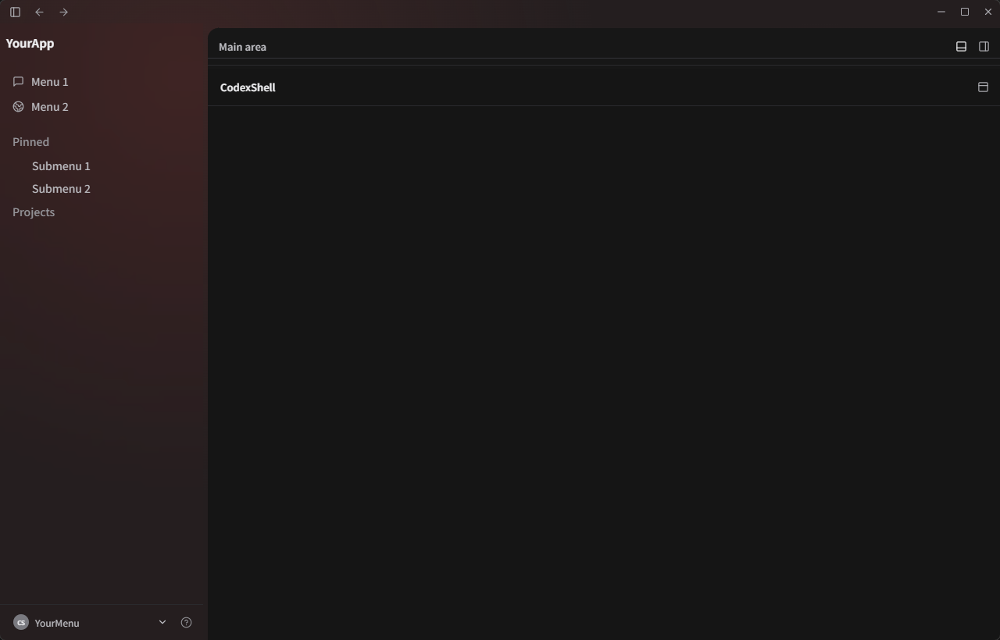

# Changelog

## 0.1.3 — 2026-08-09

- 修复窗口最大化状态下的控制图标显示。
- 最大化后显示“还原窗口”图标，恢复窗口后自动切回“最大化”图标。

## 0.1.2 — 2026-08-05

- 增加底栏全屏及退出按钮。

## 0.1.1 — 2026-08-04

- 增加菜单交互、设置入口和系统托盘关闭行为选项。
- 增加关于窗口、项目署名和中英文界面占位。
- 增加底部面板全屏与恢复控制。
