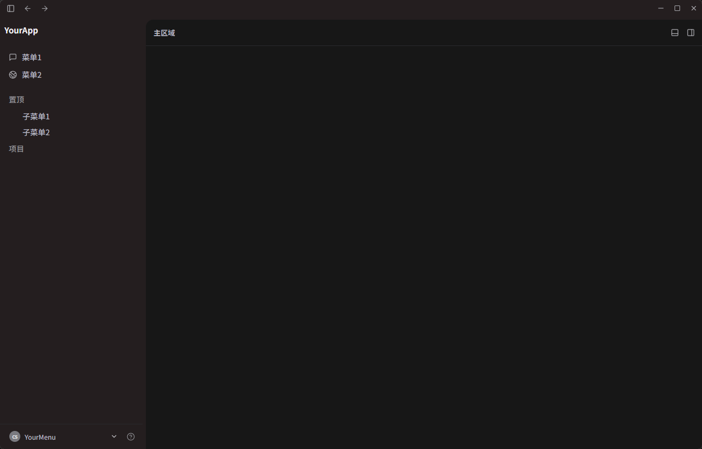
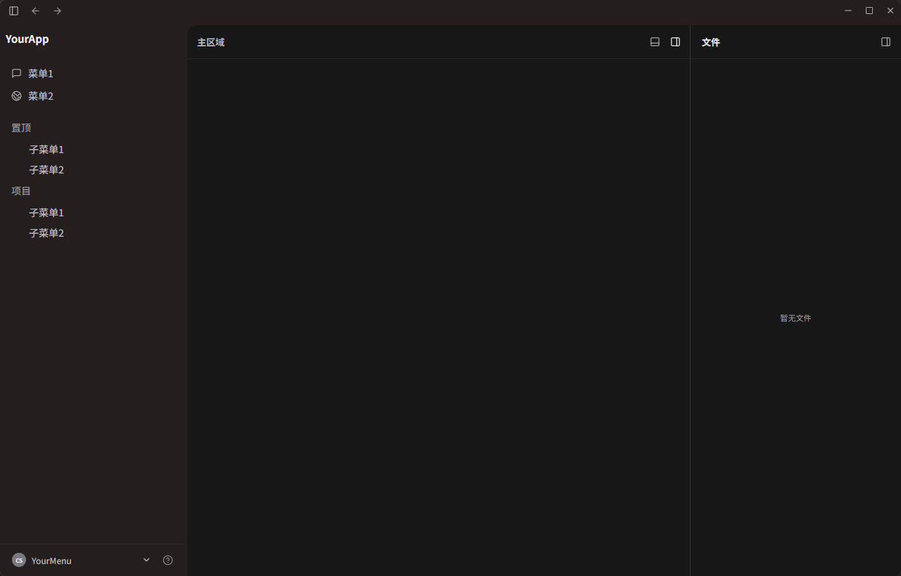
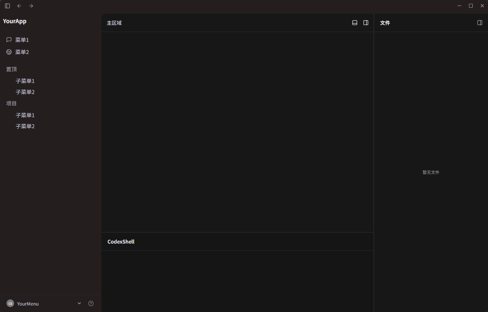
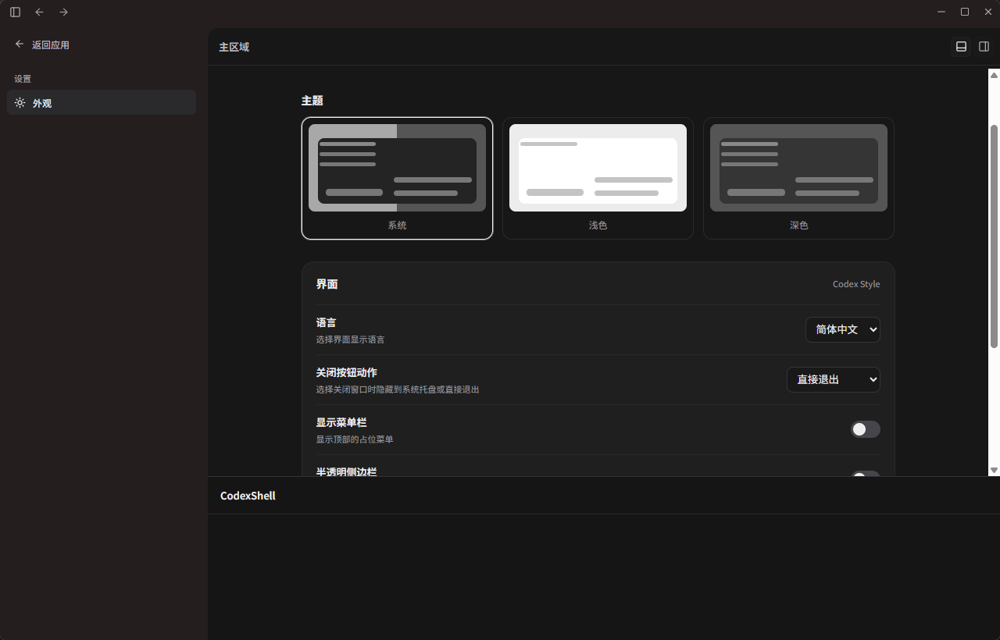
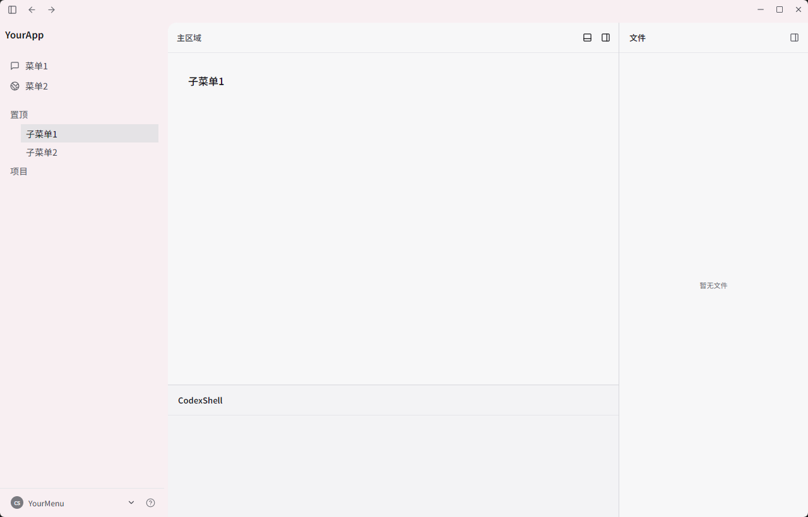

# CodexShell

CodexShell 是一个参考 Codex 风格工作台交互范式实现的 Tauri + React + TypeScript 桌面外壳。

项目只提供窗口结构、四栏布局、面板交互和视觉占位，不绑定具体业务。开发者可以在此基础上接入自己的聊天、编辑器、终端、文件管理或数据面板功能。

项目仓库：[github.com/HANSHOJIN/codex-shell](https://github.com/HANSHOJIN/codex-shell)

## 功能

- Codex 风格桌面窗口与顶部占位菜单
- 左栏、主区域、右栏、底部面板四栏布局
- 左栏、右栏和底部面板独立显示、隐藏与拖拽调整
- 拖拽到阈值后平滑吸附收起，并支持恢复
- 面板展开、收起和切换动画
- 浅色、深色、跟随系统和半透明侧边栏设置
- 简体中文 / English 界面
- 最小化、最大化、窗口拖动和系统托盘行为
- YourApp、YourMenu、YourTIPS 等占位命名

## 项目定位

本项目 codex-shell 参考经典 OpenAI Codex Playground 交互范式进行实现。

老 OpenAI Codex Playground 建立了代码类 AI 工作台经过长期验证的成熟交互模型：

**侧边可调参数面板 + Prompt 输入区域 + 流式代码输出 + 代码快捷操作**。

当前市面上绝大多数代码 AI 工具均沿用这套交互思路。像素照搬视觉样式属于界面抄袭；借鉴成熟的信息架构与交互逻辑，属于吸收行业最佳实践。

codex-shell 的核心价值不在于布局外壳，而在于后续面向具体场景的扩展能力与独有功能。

## 界面截图

### 深色基础布局


### 右侧文件面板


### 底部面板


### 外观设置


### 浅色主题


## 已实现 / 未实现

已实现：四栏布局、面板拖拽、阈值吸附、平滑动画、主题设置、语言切换、关于窗口、系统托盘和占位菜单交互。

未实现：AI、SSH、服务器管理、文件业务、终端业务及任何 OpsNest 业务功能。

## 本地运行

```powershell
npm install
npm run dev
```

运行 Tauri 桌面窗口：

```powershell
npm run tauri dev
```

检查与构建：

```powershell
npm run check
npm run build
npm run tauri build
```

## 开源许可

本项目采用 [MIT License](LICENSE) 开源。使用本框架时，请保留 CodexShell 字样和项目地址。

## 免责声明

CodexShell 是独立开源项目，名称、图标和实现不代表与 OpenAI、ChatGPT 或 Codex 存在官方关联或授权关系。
