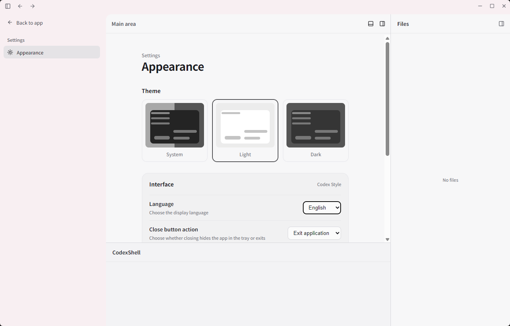
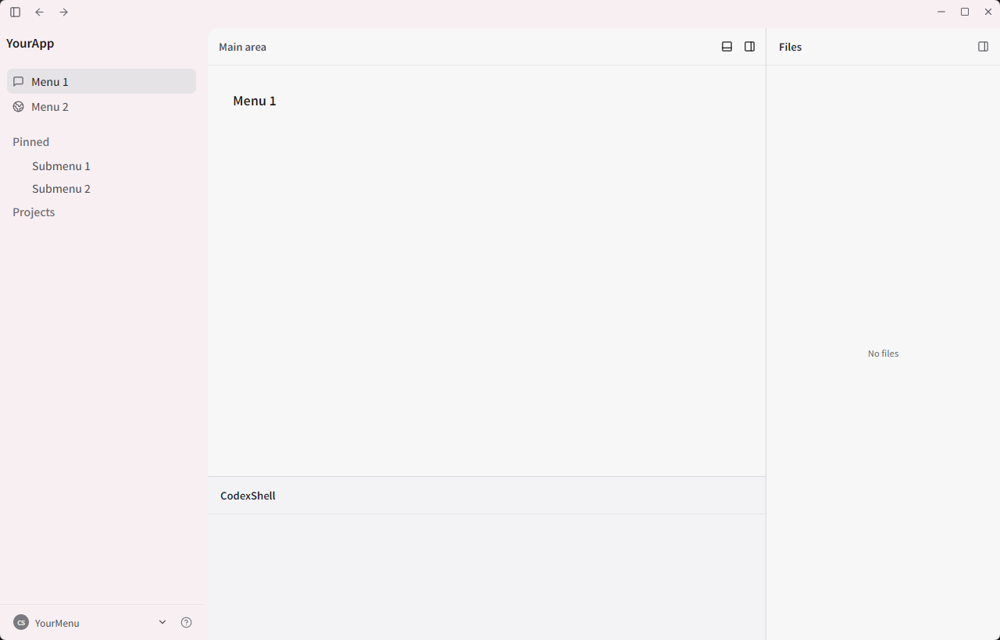
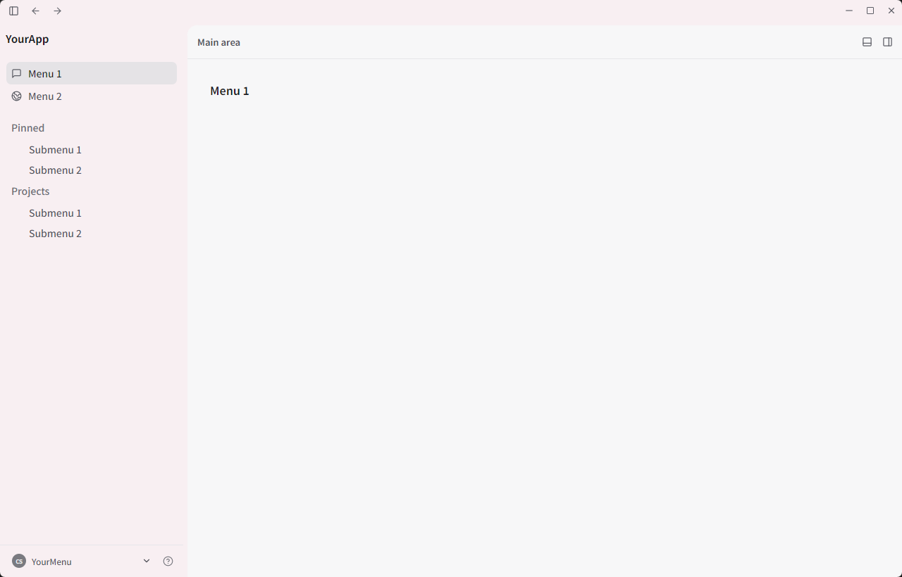
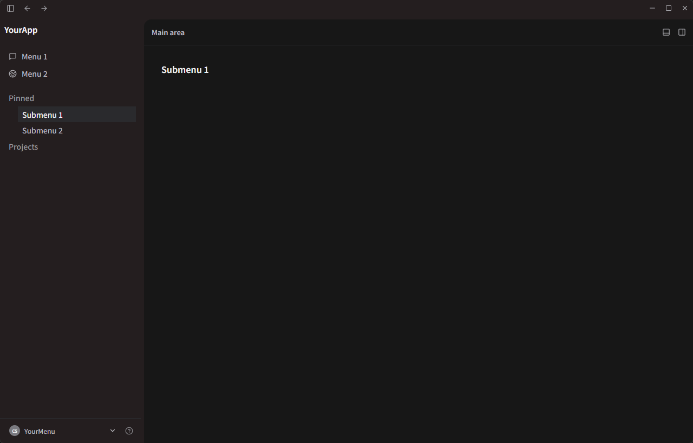
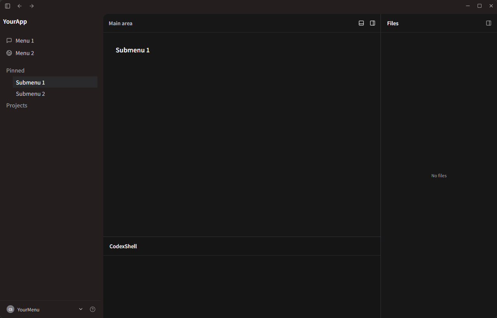

# CodexShell

A desktop shell inspired by the Codex interaction layout, designed for building applications that fit this style of workspace.

CodexShell provides the window structure, panel layout, and basic interactions without binding itself to a specific business domain. Developers can use it as a foundation for chat interfaces, editors, terminals, file managers, data panels, or other desktop applications.

Project repository: [github.com/HANSHOJIN/codex-shell](https://github.com/HANSHOJIN/codex-shell)

简体中文版本：[README.md](README.md)

## Features

- Codex-style desktop window and top navigation
- Four-panel layout: left sidebar, main area, right sidebar, and bottom panel
- Independent visibility and resizing for the sidebars and bottom panel
- Drag-to-resize panels with smooth snap-to-close behavior
- Independent panels that can be combined according to application needs
- Light, dark, and system appearance modes
- Reduced-motion support
- Built with Tauri, React, and TypeScript

## Project Positioning

CodexShell is a desktop shell intended for further development. It does not include a specific end-user application. A packaged EXE is provided as a concept demonstration, and developers can build their own application on top of it.

This project is inspired by the interaction patterns of the classic Codex Playground. Adjustable side panels, input areas, streaming output, and quick actions have become common information-architecture patterns in code-oriented AI workspaces.

CodexShell draws on general information architecture and interaction patterns rather than copying any product's specific visual assets. Layouts such as “file tree + editor + bottom panel” are widely used across desktop applications.

## Implemented

- Four-panel layout with left sidebar, main area, right sidebar, and bottom panel
- Independent opening and closing of the left sidebar, right sidebar, and bottom panel
- Resizable sidebars and bottom panel with threshold-based snap-to-close behavior
- Panel expand, collapse, and restore animations
- Persistent light, dark, system, and translucent-sidebar appearance settings
- Window minimize, maximize, resize, and close-to-system-tray behavior
- Placeholder names such as `YourApp`, `YourMenu`, and `YourTIPS`

## Current Version

**0.1** — First public version, providing the four-panel desktop layout and basic panel interactions.

This version focuses on the shell itself and does not provide a specific AI, SSH, server-management, file-management, or other business function.

## Run Locally

```powershell
npm install
npm run dev
```

To launch the Tauri desktop window:

```powershell
npm run tauri dev
```

## Check and Build

```powershell
npm run check
npm run build
npm run tauri build
```

## Directory Structure

```text
src/       React interface and layout code
src-tauri/ Tauri desktop configuration and Rust entry point
```

## License

This project is released under the [MIT License](LICENSE).

## Disclaimer

CodexShell was created as an independent open-source project based on personal interest and practical project needs. Its name, icon, and implementation are not affiliated with or authorized by OpenAI, ChatGPT, or Codex.
# CodexShell

## Screenshots

### Appearance settings


### Light layout with files panel


### Light layout with pinned submenu


### Dark submenu layout


### Dark submenu layout with files panel

